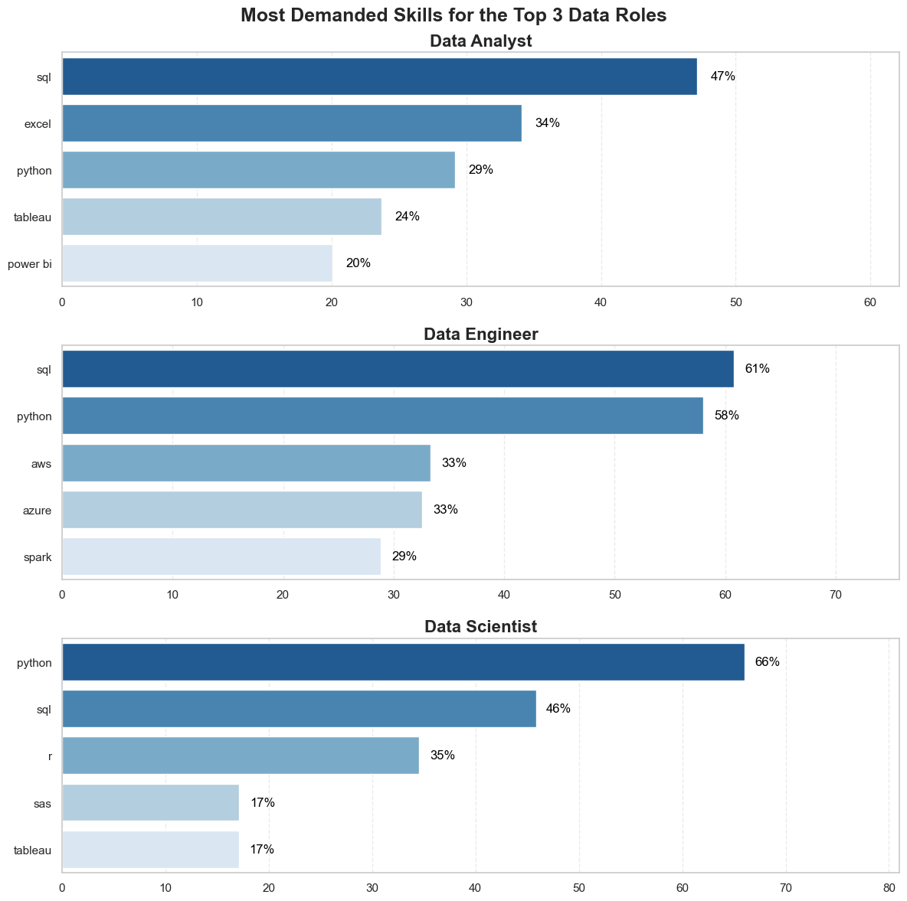
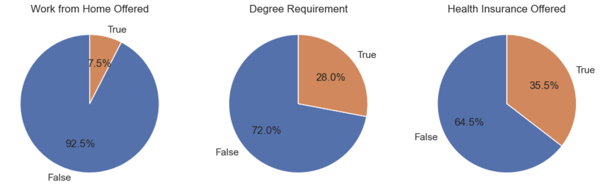
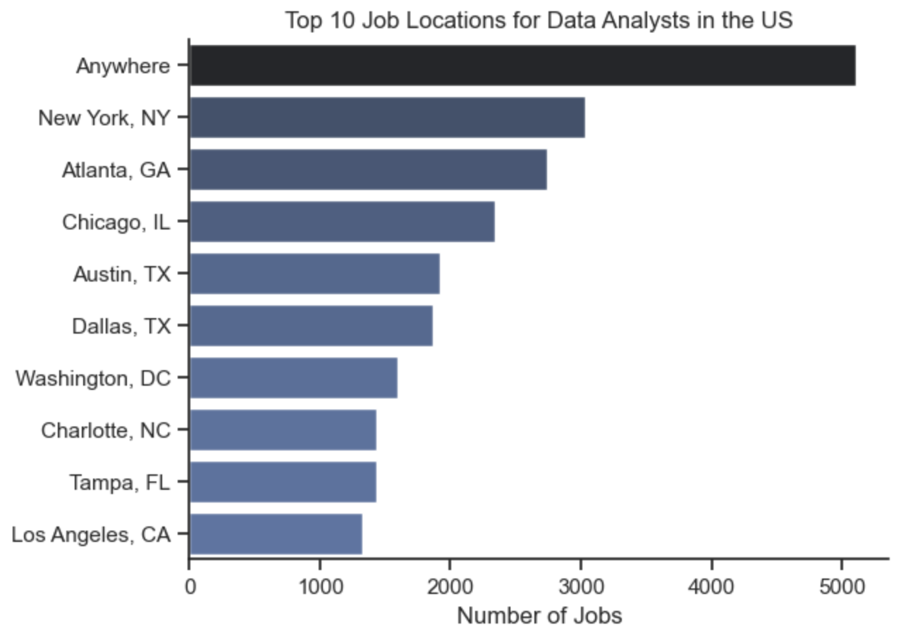
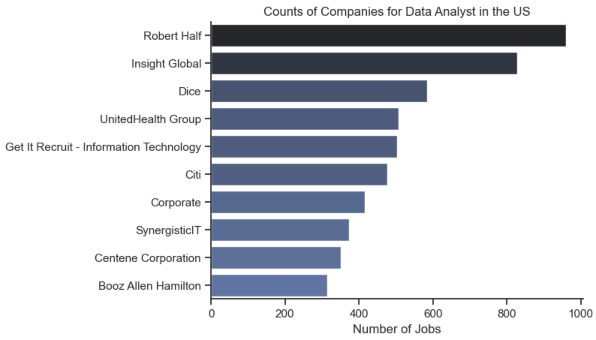
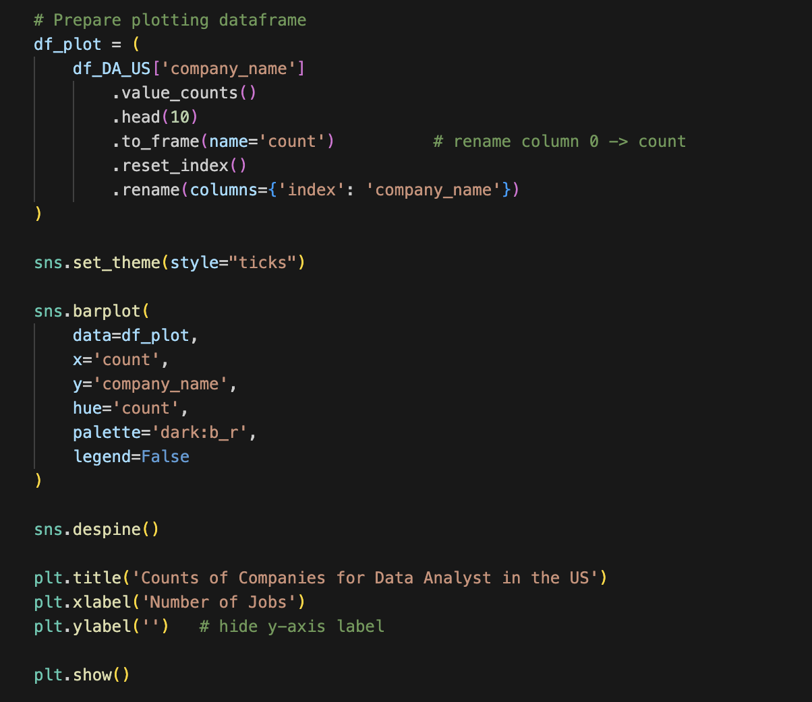

### Data Analyst Job Market Insights (US)

Welcome to my end-to-end analysis of the US data job market, focusing on the most in-demand skills, salary trends, and role-specific insights across Data Analysts, Data Engineers, and Data Scientists.

This project was created to better understand the evolving expectations of employers and identify the top skills needed to stay competitive in the data field.

🔍 Overview

This project analyzes a real dataset from US job postings, containing:

Job titles

Skills

Salaries

Locations

Essential requirements (degree, remote work, benefits)

Using Python, I cleaned, analyzed, and visualized this dataset to answer key questions about demand, required skills, and trends across the most common data roles.


❓ The Questions I Answered

What are the most in-demand skills for the top 3 most popular data roles?

How are in-demand skills trending for Data Analysts over time?

Which roles require degrees, remote work availability, and other benefits?

What skills should aspiring Data Analysts and Engineers prioritize?


🛠 Tools & Technologies Used

Python Ecosystem

Pandas — data cleaning & manipulation

Matplotlib — base data visualization

Seaborn — advanced, aesthetic visualization

Jupyter Notebooks — interactive development


Development


Visual Studio Code

Git & GitHub for version control and publishing


🧹 Data Preparation & Cleanup

The preprocessing workflow included:

Importing raw job posting data

Cleaning the skill text column


### Splitting skills into lists

Calculating:

Skill frequency

Skill percentage per job title

Creating aggregated datasets for visualization


Detailed steps are available inside the notebooks:

1.EDA.ipynb – Exploratory analysis

2_Skills_Count.ipynb – Skill frequency breakdown

3_Skills_Trend.ipynb – Skill trending over time


📈 Key Findings
1. Most Requested Skills by Role

The analysis shows:

SQL is the #1 most requested skill for Data Analysts and Data Scientists.

Python dominates jobs for Data Engineers (65–70% of postings).

Data Engineers require specialized cloud & big-data tools like AWS, Azure, Spark.

Data Analysts rely more on Excel & Tableau for reporting.


## Skill Likelihood (Top 5 per Role)



## Job Benefits Breakdown (Pie Charts)

### Work-From-Home Offered

This chart shows that only 7.5% of Data Analyst roles explicitly offer remote work, while 92.5% require on-site or hybrid attendance.

### Degree Requirement

Approximately 28% of postings require a degree, while 72% do not explicitly list one—showing a trend toward skills over formal education.

### Health Insurance Offered

The chart shows that 35.5% of postings specify health insurance benefits, while 64.5% do not explicitly mention them in the job description.

Together, these benefits charts summarize the most common job requirement and perk trends across the US Data Analyst job market.




## Top 10 Job Locations for Data Analysts in the US

This horizontal bar chart displays the cities with the highest number of Data Analyst job postings.
It highlights “Anywhere” as the dominant category, indicating that remote roles make up a large share of the market.

Major tech and business hubs like New York, Atlanta, Chicago, and Austin also appear prominently, showing the geographic distribution of opportunities across the US.



## Top Companies Hiring Data Analysts

This visualization shows the organizations with the most Data Analyst job postings.
Recruiting firms like Robert Half, Insight Global, and Dice lead the list—demonstrating that staffing agencies play a significant role in data talent acquisition.





### Top Employers Bar Chart – Code Snippet Visualization

This image corresponds to the code used to generate the bar chart of top companies.
It demonstrates:

* Preparing a value-count summary of company postings

* Using Seaborn’s barplot for clean, professional visuals

* Adding formatting customizations like color palette, despine, and label cleanup




### Each chart includes:
✔ Clean Seaborn theme
✔ Percent labels
✔ Sorted bars
✔ Professional color palette

Notebook: [2.Skill_Count.ipynb](Project/2.Skill_Count.ipynb)

## Repository Structure
```
.
├── Basic/                # Introductory pandas practice notebooks.
├── Advanced/xz/          # Deeper pandas/seaborn/matplotlib exercises plus example datasets.
└── Project/
    ├── 1.EDA.ipynb       # Main exploratory analysis of U.S. data analyst job postings.
    └── 2.Skill_Count.ipynb  # Placeholder notebook for upcoming skill-frequency analysis.
```

Focus on the notebooks under `Project/`, which contain the analysis summarized in this README.

## Environment & Setup
1. **Python:** Version 3.10+ recommended.
2. **Create a virtual environment (optional but encouraged):**
   ```bash
   python -m venv .venv
   source .venv/bin/activate  # Windows: .venv\Scripts\activate
   ```
3. **Install core dependencies:**
   ```bash
   pip install pandas seaborn matplotlib datasets notebook
   ```
4. **Launch Jupyter Lab or Notebook:**
   ```bash
   jupyter lab  # or `jupyter notebook`
   ```

## Reproducing the Analysis
1. Open `Project/1.EDA.ipynb`.
2. Run the first cell to import libraries, download the dataset from HuggingFace, and clean the `job_posted_date` plus `job_skills` columns.
3. Execute the filtering cell to create `df_DA_US`, which holds U.S. data analyst roles.
4. Run the visualization cells:
   - Top job locations (`sns.barplot`).
   - Benefits/requirements pie charts covering remote availability, degree mentions, and health insurance.
   - Employer counts for the top 10 hiring companies.
5. (Optional) Extend the empty `Project/2.Skill_Count.ipynb` notebook with additional aggregations over the `job_skills` list—e.g., explode the lists and compute frequency ranks.

All charts render inline, making it easy to iterate on styling or drill further into specific subsets.


## Key Questions & Insights
- **Where are the jobs?** The first bar chart highlights the 10 U.S. cities/regions with the most postings, helping prioritize job searches geographically.
- **What perks are common?** Pie charts clarify the share of roles that allow remote work, waive degree requirements, or offer health insurance.
- **Who is hiring?** The company leaderboard shows which employers (or staffing firms) post the most data analyst openings.
- **What skills matter?** Planned skill-count analysis will summarize recurring technologies in `job_skills`, guiding resume and learning priorities.

Even without modifying the data, these visuals offer a quick pulse on demand hotspots and candidate expectations.

